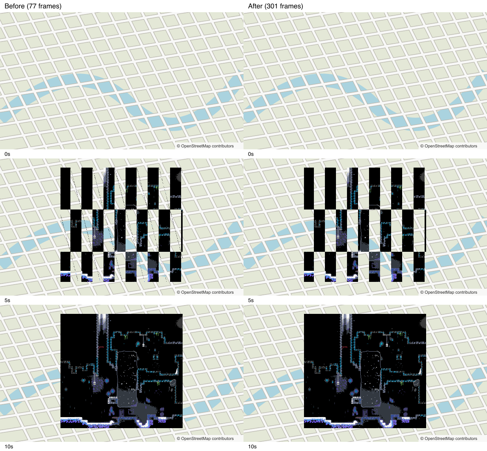

# Timelapse GIF size

Issue #357 keeps **640x360** previews and the existing gifenc encoder. Unchanged history frames
share a delay. Later frames encode unchanged pixels as transparent, with disposal 1 preserving the
previous canvas. Changed pixels still use a per-frame 128-color palette. Transparency gets a
separate palette entry, so it does not displace an artwork color.

The first frame paints the whole canvas. History keeps its ten-second timing and both endpoint
states. The final state has a separate five-second hold, using a one-pixel transparent frame when
it matches the last history canvas. The animation loops forever. Source history stays untouched.
The existing 4.5 MB fallback still reduces history frames if required, retaining both endpoints.

## Measurements

Run from the repository root:

```sh
pnpm install --frozen-lockfile
pnpm --filter @caelestis/shared build
node scripts/benchmark-social-gifs.mjs
```

The script writes GIFs, final-state PNGs, and `results.json` under
`.scratch/social-images/benchmark-357`. Each case runs in a fresh Node process.

These are **synthetic histories**, using the pinned Berrycamp `site/a/0.json` artwork and a
deterministic map-like background. They do not reproduce the reported production GIF. Each source
has 300 history states and a final state. The quiet scene starts 98% complete and changes every 30
observations. The active scene reveals artwork throughout the history. Every case samples the same
source scene at its target dimensions and stamps the real attribution at its original 180x18 size.

Measured on Apple M4, Node 24.20.0, gifenc 1.0.3, Sharp 0.35.4, on 11 September 2026.
Times cover encoding, including baseline size retries. Peak RSS covers the whole process through
encoding, including fixture preparation and retained RGBA frames. It excludes subsequent validation
decodes. These are single-run measurements; timing and memory vary with runtime and machine load.

| Scene | Current bytes | New bytes | Reduction | Current / new frames | Current / new encoding | Current / new peak RSS |
| --- | ---: | ---: | ---: | ---: | ---: | ---: |
| Quiet | 2,297,999 | 46,891 | 98.0% | 77 / 11 | 2,340 / 226 ms | 447 / 431 MiB |
| Active | 2,530,848 | 567,270 | 77.6% | 77 / 301 | 1,783 / 918 ms | 543 / 459 MiB |

Frame counts include the final hold. The current renderer drops history to 76 frames to fit its
size ceiling. Without that fallback, full-frame outputs are 8,990,728 and 9,927,996 bytes.
The new renderer keeps all distinct sampled history states in these scenes.

## Alternatives

| Strategy | Dimensions | Quiet / active bytes | Quiet / active encoding | Quiet / active peak RSS |
| --- | --- | ---: | ---: | ---: |
| Current encoder | 480x270 | 3,084,424 / 3,481,952 | 1,113 / 879 ms | 394 / 423 MiB |
| Current encoder | 320x180 | 3,141,016 / 3,502,782 | 309 / 298 ms | 291 / 285 MiB |
| Coalesce only, without size fallback | 640x360 | 326,891 / 9,927,996 | 65 / 952 ms | 420 / 530 MiB |
| Shared palette, 127 colors plus transparency | 640x360 | 42,599 / 451,472 | 112 / 624 ms | 433 / 439 MiB |
| Shared palette, 63 colors plus transparency | 640x360 | 42,599 / 451,045 | 101 / 596 ms | 435 / 441 MiB |
| Sharp changed regions, 128 colors | 640x360 | 52,070 / 576,527 | 4,264 / 4,876 ms | 683 / 687 MiB |
| Selected strategy | 480x270 | 33,165 / 418,758 | 133 / 544 ms | 365 / 362 MiB |
| Selected strategy | 320x180 | 19,710 / 293,783 | 65 / 275 ms | 270 / 261 MiB |

Smaller baseline dimensions retain more frames before hitting the size ceiling, explaining their
larger final files. The full results also include shared palettes at 480 and 320 pixels wide.

Keep 640x360 because smaller samples lose fine artwork detail. Attribution stays legible at each
tested size, but occupies much more of the 320x180 image. Shared palettes save another 9-20%; the
tested bounded sampler can miss rare colors, and the lower palette budget offers little extra here.
Keeping per-frame quantization avoids introducing that sampling tradeoff.

[gifenc](https://github.com/mattdesl/gifenc#api) supports transparency and disposal control but
does not expose frame offsets. Our delta frames retain full dimensions. The
[Sharp encoder](https://sharp.pixelplumbing.com/api-output/#gif) cropped 300 of the active GIF's
301 image rectangles. It was slower, used more memory, and produced a slightly larger file.
Its benchmark disables dithering and inter-frame/inter-palette error tolerances.

The selected implementation adds no dependencies. gifenc remains the existing JavaScript runtime
dependency, compatible with the Worker and Node renderer. Its distribution is 22,617 bytes, or
5,655 bytes gzipped. Sharp is already a development dependency;
using its native libvips encoder in production would require a separate Node-only encoding path.
The installed macOS arm64 libvips package occupies about 17.4 MiB before Sharp's own native binding.

## Preview samples and checks

Open the [quiet animation](assets/timelapse-gifs/quiet.gif) or
[active animation](assets/timelapse-gifs/active.gif). The benchmark command regenerates both full
before/after animations. The comparison below shows decoded states at 0, 5, and 10 seconds.



Visual inspection found readable attribution and retained artwork detail. Unchanged pixels keep
their earlier quantized color instead of shifting as each frame's palette changes. The final active
sample differs from the old renderer by a mean 0.0055 per RGB channel on a 0-255 scale, with maximum
difference 8. The quiet sample's mean is 0.0025, maximum 2. This is palette rounding, not lost states.

Decoded-pixel tests cover repainting, erasures, static pixels, and all 128 colors. Timing tests cover
coalesced tick sums, 300 changing history frames, a distinct final state, and a matching final hold.
Existing renderer tests cover map attribution, archive gaps, finished templates, and first-image
artwork. Focused size-limit tests preserve endpoint states and duration through retries.
